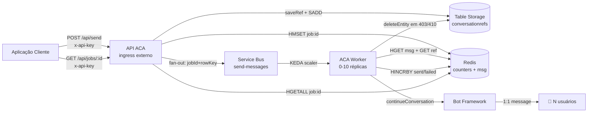
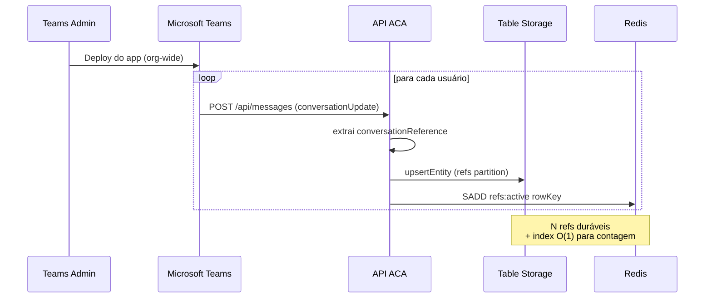
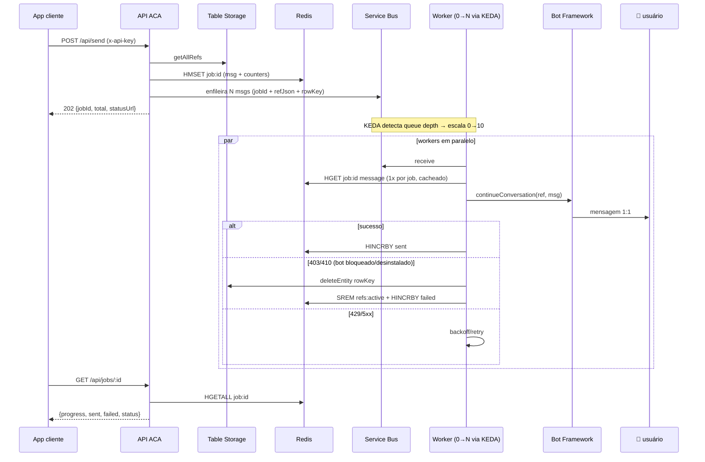
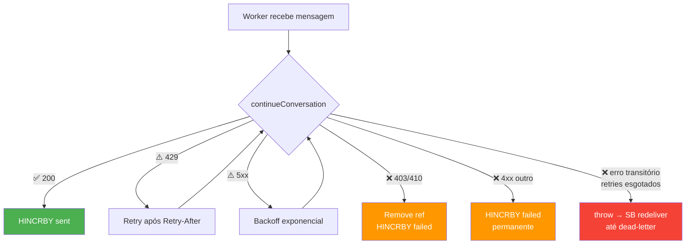

# 📨 Teams Proactive Messaging

Demo de referência para envio de **mensagens proativas 1:1 em massa** via Microsoft Teams para dezenas/centenas de milhares de funcionários, contornando os rate limits do Power Platform e Graph API.

> ⚠️ **Este repositório é demo / prova de conceito**. Antes de usar em produção, revise: segurança, escalabilidade, observabilidade, custos e conformidade. Veja [DISCLAIMER.md](./DISCLAIMER.md) e [SUPPORT.md](./SUPPORT.md).

---

## Por que essa arquitetura?

Em cenários reais de comunicação corporativa em massa via Teams (10k–100k+ usuários), as alternativas comumente tentadas têm limitações:

| Abordagem | Limitação |
|---|---|
| **Power Automate / Power Platform** | Throttling agressivo (~6k chamadas/dia por conexão), custo por execução, latência alta em massa. |
| **Microsoft Graph (chats / messages)** | Limites por app e por usuário, criação de chat 1:1 é cara, geralmente pensada para uso interativo. |
| **Bot Framework — proactive messaging** | Canal **projetado** para esse caso. Throughput sustentado de ~50 msg/s por bot, com fan-out por workers. |

Esta demo **não burla rate limits** — usa o canal certo. O envio depende do Teams App estar instalado para cada usuário (org-wide via Admin Center), o que faz o bot capturar uma `conversationReference` por usuário e usá-la depois para mandar mensagens 1:1 sem nova interação.

---

## Índice

- [Arquitetura](#arquitetura)
- [Componentes Azure](#componentes-azure)
- [Fluxo de funcionamento](#fluxo-de-funcionamento)
- [Endpoints da API](#endpoints-da-api)
- [Segurança](#segurança)
- [Estrutura do projeto](#estrutura-do-projeto)
- [Como iniciar (dev local)](#como-iniciar-dev-local)
- [Deploy em Azure](#deploy-em-azure)
- [Deploy do Teams App](#deploy-do-teams-app)
- [Benchmarks](#benchmarks)
- [Roadmap (não implementado)](#roadmap-não-implementado)
- [Troubleshooting](#troubleshooting)

---

## Arquitetura



**Princípios:**

- **Redis = caminho quente** — counters atômicos (HINCRBY), index de refs ativos (SCARD), cache do payload da mensagem.
- **Table Storage = durabilidade** — fonte da verdade das `conversationReferences`.
- **Service Bus = fan-out** — desacopla API de workers, permite KEDA scale-to-zero, dead-letter para falhas permanentes.
- **ACA = compute** — API com `minReplicas=1` (sempre ouvindo eventos do Teams) + Worker com `minReplicas=0` (custo zero quando ocioso).

---

## Componentes Azure

| Recurso | SKU | Função | Custo aprox. |
|---|---|---|---|
| App Registration | Free | Identidade do bot (SingleTenant) | $0 |
| Azure Bot | F0 | Registro Bot Framework + canal Teams | $0 |
| Container Apps (API) | Consumption | Ingress externo, `minReplicas=1` | ~US$ 5/mês |
| Container Apps (Worker) | Consumption | KEDA scale-to-zero, 0–10 réplicas | pay-per-use |
| Service Bus | Basic | Fila + dead-letter | ~US$ 0.05/mês |
| Table Storage | Standard LRS | Refs duráveis | ~US$ 0.01/mês |
| Azure Cache for Redis | C0 Basic | Counters + refs index + msg cache | ~US$ 16/mês |
| Container Registry | Basic | Imagens API + Worker | ~US$ 5/mês |
| Log Analytics | Pay-per-GB (cap 25MB/d) | Logs ACA | ~US$ 2/mês |

> 💡 Custo total de uma demo: ~**US$ 28/mês**. Workers só geram custo quando há mensagens na fila.

---

## Fluxo de funcionamento

### Fase 1 — Registro de usuários (passivo)



### Fase 2 — Disparo do comunicado



### Fase 3 — Tratamento de erros



---

## Endpoints da API

| Método | Path | Auth | Descrição |
|---|---|---|---|
| POST | `/api/messages` | Bot Framework token | Endpoint do Bot Framework (configure como Messaging Endpoint no Azure Bot) |
| POST | `/api/send` | `x-api-key` | Enfileira N mensagens, retorna `202 Accepted` |
| GET | `/api/jobs/:id` | `x-api-key` | Progresso do job (Redis) |
| GET | `/api/status` | `x-api-key` | Contagem de usuários registrados |
| GET | `/healthz` | — | Liveness simples |
| GET | `/readyz` | — | Readiness (Redis + Storage) |

### `POST /api/send`

```http
POST /api/send
Content-Type: application/json
x-api-key: <API_KEY>

{ "message": "📢 Comunicado importante para todos os colaboradores!" }
```

```json
HTTP/1.1 202 Accepted
{
  "jobId": "d836...",
  "total": 50000,
  "enqueued": 50000,
  "status": "queued",
  "statusUrl": "/api/jobs/d836..."
}
```

### `GET /api/jobs/:id`

```json
{
  "jobId": "d836...",
  "message": "📢 Comunicado importante para todos os colaboradores!",
  "total": 50000,
  "sent": 49988,
  "failed": 12,
  "status": "completed",
  "progress": 100,
  "createdAt": "...",
  "updatedAt": "...",
  "errors": ["Usuário bloqueou/desinstalou o bot", "..."]
}
```

| `status` | Significado |
|---|---|
| `queued` | Job criado, mensagens sendo enfileiradas |
| `processing` | Workers estão enviando |
| `completed` | Todas processadas (enviadas + falhadas = total) |

---

## Segurança

- `POST /api/send`, `GET /api/jobs/:id`, `GET /api/status` exigem header `x-api-key` quando `API_KEY` está definida.
- **Em dev local**, deixar `API_KEY` vazia desliga a checagem (a API loga um warning ao iniciar).
- **Em produção / cliente**, considere alternativas mais robustas (em ordem de robustez):
  - Entra ID com client credentials + JWT bearer + middleware de validação;
  - APIM como front-door com policies;
  - ACA com ingress interno + APIM/AGW público;
  - mTLS ou IP allowlist via NSG.
- Secrets sensíveis (`MICROSOFT_APP_PASSWORD`, `SERVICE_BUS_CONNECTION`, `STORAGE_CONNECTION`, `REDIS_CONNECTION`, `API_KEY`) devem ir em **ACA secrets** ou **Key Vault** com Managed Identity, nunca em env vars planas.

---

## Estrutura do projeto

```
teams_msgs/
├── src/                       # API (ACA, ingress externo)
│   ├── index.ts               # Express + endpoints + auth + healthz/readyz
│   ├── bot.ts                 # ProactiveBot (captura conversationReferences)
│   ├── table-store.ts         # Refs duráveis em Table Storage + sincroniza Redis SET
│   └── redis-tracker.ts       # Job counters + refs index + cache da mensagem
├── worker/                    # Worker (ACA, KEDA scale-to-zero)
│   ├── src/
│   │   ├── index.ts           # bootstrap
│   │   ├── worker.ts          # Service Bus consumer + Bot Framework sender
│   │   ├── redis-tracker.ts   # incrementSent/Failed + getJobMessage
│   │   └── table-store.ts     # removeRefByRowKey (limpeza em 403/410)
│   └── Dockerfile
├── manifest/                  # Pacote Teams App
│   ├── manifest.json
│   ├── color.png              # 192x192
│   └── outline.png            # 32x32
├── load_test/
│   ├── run-50k.js             # Single-job, N usuários simulados
│   └── run-waves.js           # Waves sequenciais (cold start vs warm)
├── Dockerfile                 # API
├── .env.example
├── package.json
├── tsconfig.json
├── DISCLAIMER.md
├── SUPPORT.md
├── LICENSE
└── README.md
```

---

## Como iniciar (dev local)

```bash
git clone https://github.com/EdneiMonteiro/teams_msgs.git
cd teams_msgs
npm install
cd worker && npm install && cd ..
cp .env.example .env       # edite com seus valores
npm run dev                # API em http://localhost:3978

# Em outro terminal — expõe o endpoint para o Bot Framework:
ngrok http 3978
# → atualize o Messaging Endpoint do Azure Bot para https://<ngrok>/api/messages
```

Para rodar o worker localmente (apontando para Redis/Service Bus reais):
```bash
cd worker
npm run build && npm start
```

---

## Deploy em Azure

```bash
RG=rg-teams-msgs
LOC=eastus2
ACR=acrteamsmsgs

# Resource group + recursos base
az group create -n $RG -l $LOC
az servicebus namespace create -g $RG -n sb-teams-msgs --sku Basic
az servicebus queue create -g $RG --namespace-name sb-teams-msgs \
  -n send-messages --max-delivery-count 5
az storage account create -g $RG -n stteamsmsgs --sku Standard_LRS
az redis create -g $RG -n redis-teams-msgs -l $LOC --sku Basic --vm-size c0
az acr create -g $RG -n $ACR --sku Basic --admin-enabled true

# ACA Environment compartilhado
az containerapp env create -g $RG -n aca-teams-msgs -l $LOC

# Build das imagens
az acr build -r $ACR -t teams-msgs-api:v1 -f Dockerfile .
az acr build -r $ACR -t teams-msgs-worker:v1 -f worker/Dockerfile worker/

# Deploy API (ingress externo, always-on)
az containerapp create -g $RG -n api-teams-msgs \
  --environment aca-teams-msgs \
  --image $ACR.azurecr.io/teams-msgs-api:v1 \
  --min-replicas 1 --max-replicas 3 \
  --ingress external --target-port 3978 \
  --secrets sb-conn=<sb> storage-conn=<st> redis-conn=<redis> \
            app-pwd=<bot> api-key=<random> \
  --env-vars MICROSOFT_APP_ID=<id> MICROSOFT_APP_TENANT_ID=<tenant> \
             PORT=3978 \
             SERVICE_BUS_CONNECTION=secretref:sb-conn \
             STORAGE_CONNECTION=secretref:storage-conn \
             REDIS_CONNECTION=secretref:redis-conn \
             MICROSOFT_APP_PASSWORD=secretref:app-pwd \
             API_KEY=secretref:api-key

# Atualizar Messaging Endpoint do Azure Bot
az bot update -g $RG -n teams-proactive-msgs-bot \
  --endpoint "https://<api-fqdn>/api/messages"

# Deploy Worker (KEDA scale-to-zero)
az containerapp create -g $RG -n worker-teams-msgs \
  --environment aca-teams-msgs \
  --image $ACR.azurecr.io/teams-msgs-worker:v1 \
  --min-replicas 0 --max-replicas 10 \
  --secrets sb-conn=<sb> storage-conn=<st> redis-conn=<redis> app-pwd=<bot> \
  --env-vars MICROSOFT_APP_ID=<id> MICROSOFT_APP_TENANT_ID=<tenant> \
             MAX_CONCURRENT=10 \
             SERVICE_BUS_CONNECTION=secretref:sb-conn \
             STORAGE_CONNECTION=secretref:storage-conn \
             REDIS_CONNECTION=secretref:redis-conn \
             MICROSOFT_APP_PASSWORD=secretref:app-pwd \
  --scale-rule-name sb-queue \
  --scale-rule-type azure-servicebus \
  --scale-rule-metadata queueName=send-messages messageCount=5 \
  --scale-rule-auth connection=sb-conn
```

---

## Deploy do Teams App

1. Edite `manifest/manifest.json` substituindo `<MICROSOFT_APP_ID>` e `<your-api-fqdn>`.
2. Empacote: `cd manifest && zip ../teams-app.zip manifest.json color.png outline.png`
3. Suba em **Teams Admin Center → Manage apps → Upload new app**.
4. **Setup policies → Global → Installed apps → Add apps** (org-wide).
5. Propagação org-wide leva 24–48h. Para testes imediatos, instale manualmente em **Apps → Built for your org**.

---

## Benchmarks

Medidos em ambiente real: 1 worker ACA (0.5 vCPU, 1Gi), Redis C0 Basic, Table Storage LRS, Service Bus Basic. Cada job dispara N mensagens 1:1 a partir de 1 POST.

### Resultado de referência — single-job 50K (versão atual, v6)

| Métrica | Valor |
|---|---|
| Total de mensagens | **50.002** |
| Enviadas | **50.002** (100%) |
| Falhas | **0** |
| Tempo de enqueue (Service Bus) | **64.2s** |
| Tempo de processamento | **70.1s** |
| Tempo total | **134.3s** (~2 min 14 s) |
| **Throughput sustentado** | **42.821 msg/min** (~714 msg/s) |

> Relatório bruto: `load_test/report-50k.json`. Reproduza com:
> `node load_test/run-50k.js --refs 50000` (precisa de `BOT_URL`, `API_KEY` e `STORAGE_CONNECTION` no env).

### Histórico de evolução (mesmo cenário — 50K refs)

| Versão | Arquitetura | Throughput | Falhas | Observação |
|---|---|---:|---:|---|
| v1 (POC) | Cosmos DB + ETag retries | — | travado em 71% | Race condition em writes concorrentes |
| v3 | Redis (counters) + Table Storage (refs/jobs) | 30.976 msg/min | 0 | Job tracking no Redis resolve race condition |
| **v6 (atual)** | **Redis (counters + refs index + msg cache) + Table Storage (refs)** | **42.821 msg/min** | **0** | Mensagem cacheada no Redis, payload SB menor, hash do messageId |

### Waves (volume crescente)

| Refs | Total Msgs | Sent | Failed | Enqueue | Processing | Throughput |
|---:|---:|---:|---:|---:|---:|---:|
| 500 | 502 | 502 | 0 | 0.9s | 50.7s | 595 msg/min ¹ |
| 1.000 | 1.002 | 1.002 | 0 | 0.7s | 3.2s | 18.953 msg/min |
| 10.000 | 10.002 | 10.002 | 0 | 16.5s | 12.9s | 46.481 msg/min |
| 15.000 | 15.002 | 15.002 | 0 | 13.2s | 57.5s | 15.654 msg/min ¹ |

¹ Throughput menor por cold start do KEDA (scale-to-zero → primeiro container demora ~45s para subir).

> 📌 Os números usam **fake refs** (clones de uma ref real), que validam o caminho de fan-out, fila, autoscale, job tracking e remoção de refs inválidas — mas **não exercitam o Bot Framework com 50k usuários distintos**. Em cenário real:
> - **Bot Framework é o gargalo final** (~50 msg/s sustentado por bot, ~3.000 msg/min)
> - 100k mensagens em ~30–40 minutos com 1 bot
> - Para janelas mais agressivas, paralelizar com múltiplos bots por audiência

---

## Roadmap (não implementado nesta demo)

Items que fariam sentido em uma evolução para produção:

- **Token bucket global no Redis** — limita o envio agregado por bot/tenant, independente do número de workers (KEDA escala compute, mas o teto real é o Bot Framework).
- **Backpressure adaptativo** — reduzir concorrência por worker quando 429s aparecerem; aumentar quando 200s sustentados.
- **Segmentação de audiência** — `POST /api/send` com filtro (lista CSV, departamento, país, tags).
- **Adaptive Cards** — aceitar `message` como string OU `{type, content}` para Adaptive Card.
- **Idempotência forte** — Service Bus Standard/Premium com duplicate detection (já populamos `messageId`).
- **Reconciliação Redis ↔ Table** — job periódico para sincronizar `refs:active` SET com a tabela.
- **Particionamento das refs** — distribuir entre múltiplas partitions por hash, evitando hot partition em Table Storage.
- **Auditoria + governança** — modelo de "campanha" com owner, aprovação, dry-run, histórico.
- **OIDC / Entra ID** — substituir `x-api-key` por validação de JWT.

---

## Troubleshooting

| Sintoma | Causa | Solução |
|---|---|---|
| `Authorization denied` no envio | Service Principal ausente no tenant alvo | `az ad sp create --id <app-id>` |
| `Failed to decrypt conversation id` | Tipo do bot foi alterado depois das refs serem salvas | Limpe a tabela `conversationrefs` e reinstale o Teams app |
| `401 Unauthorized` em `/api/send` | `x-api-key` faltando ou divergente | Veja env var `API_KEY` na ACA |
| Workers não escalam | Regra KEDA mal configurada | `az containerapp show` e verifique `scale.rules` |
| `403 Forbidden` em alguns usuários | Usuário bloqueou ou desinstalou o bot | Normal — agora o worker remove a ref automaticamente |
| `429 Too Many Requests` em volume | Throttling do Bot Framework | Workers fazem retry com `Retry-After`; reduza `MAX_CONCURRENT` se persistir |
| `/readyz` retorna 503 | Redis ou Storage não acessíveis | Cheque connection strings e regras de firewall |

---

## Suporte e Aviso Legal

- Sem SLA nem suporte oficial. Veja [SUPPORT.md](./SUPPORT.md).
- Uso sujeito a [DISCLAIMER.md](./DISCLAIMER.md).
- **Não afiliado nem endossado pela Microsoft.** Marcas usadas apenas para descrição.
