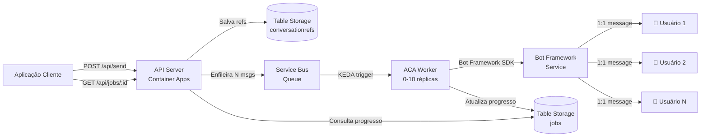
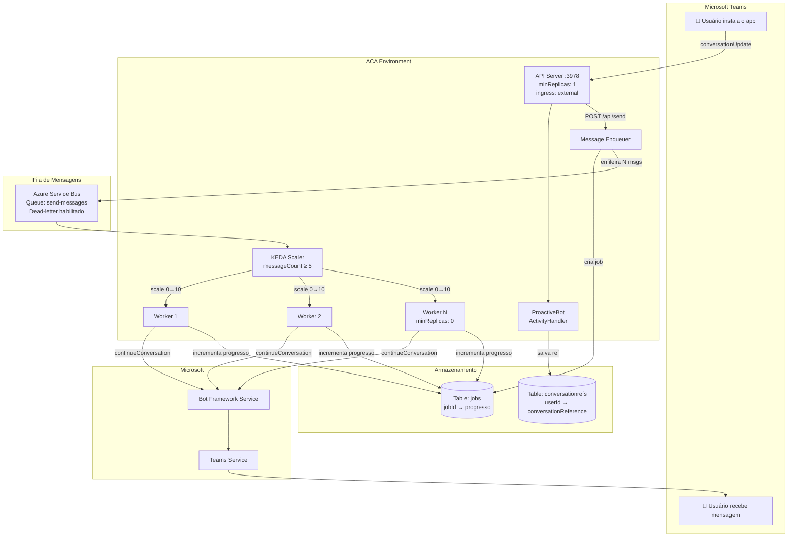
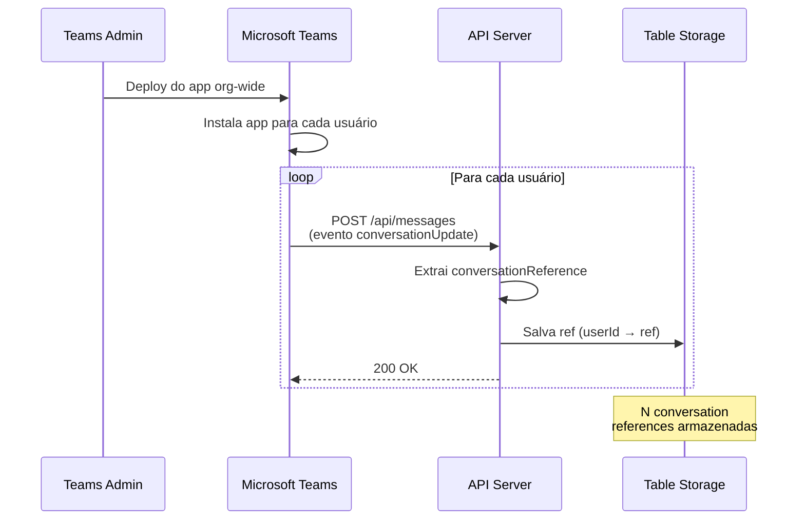
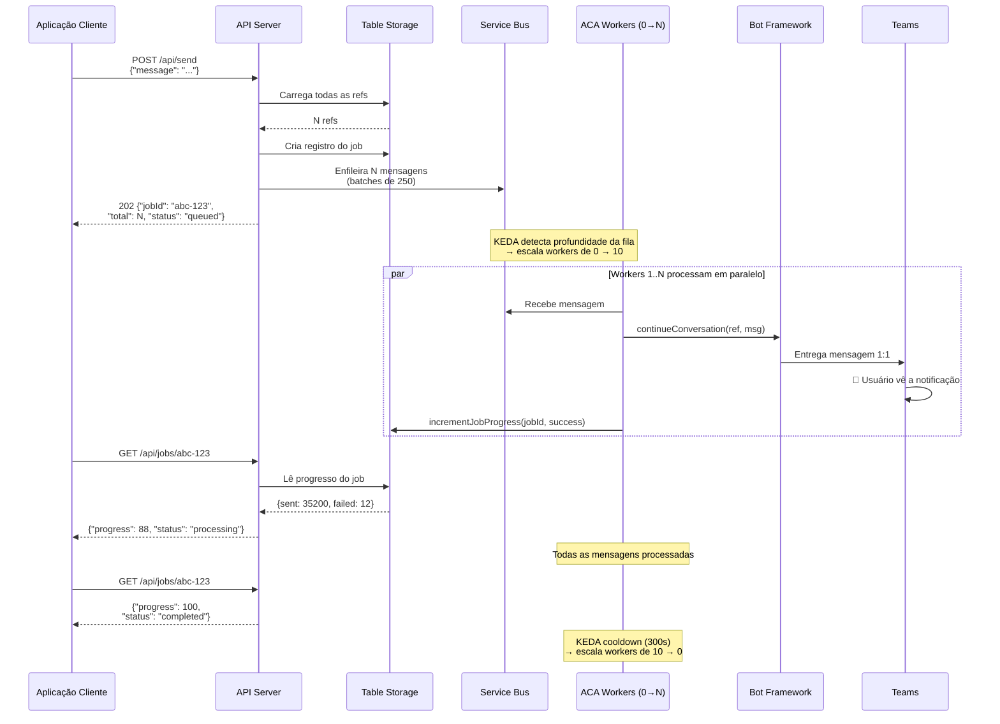
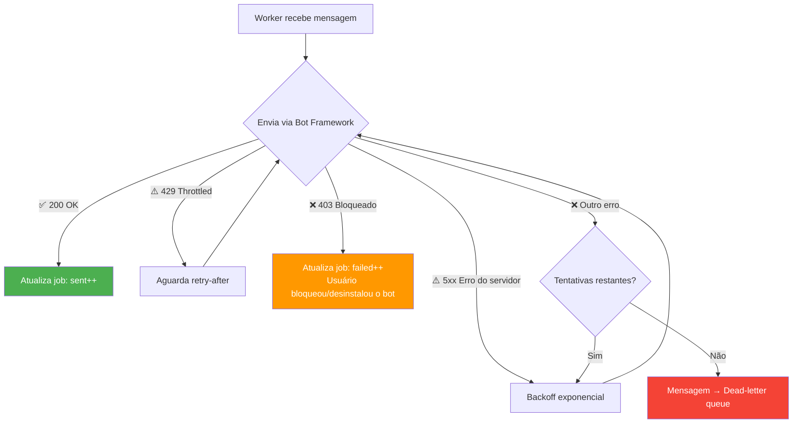
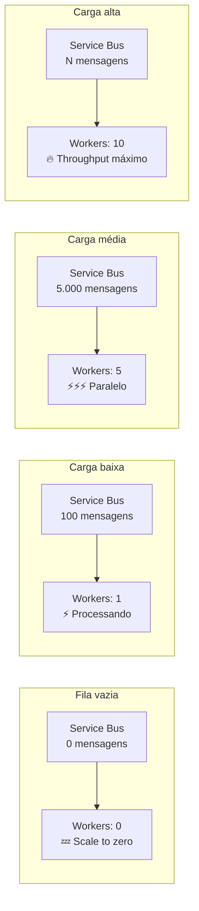

# 📨 Teams Proactive Messaging

## Visão Geral

Este repositório contém código de exemplo / prova de conceito (PoC) com o objetivo de demonstrar como implementar envio de mensagens proativas 1:1 em massa via Microsoft Teams, utilizando Bot Framework, Azure Service Bus e Azure Table Storage.

Este projeto foi criado para fins de aprendizado, avaliação e experimentação.

## ⚠️ Aviso Importante

Este repositório contém **código de exemplo e não é destinado para uso em produção**.

Antes de utilizar qualquer parte deste projeto em um ambiente produtivo ou crítico, é essencial revisar, validar, proteger e adaptar o código conforme os requisitos da sua organização, incluindo:

- Segurança
- Escalabilidade
- Confiabilidade
- Monitoramento
- Observabilidade
- Custos
- Conformidade

Leia também:

- [DISCLAIMER.md](./DISCLAIMER.md)
- [SUPPORT.md](./SUPPORT.md)

---

## Índice

- [O que este exemplo demonstra](#o-que-este-exemplo-demonstra)
- [Arquitetura](#arquitetura)
- [Fluxo de Funcionamento](#fluxo-de-funcionamento)
- [Recursos Azure Necessários](#recursos-azure-necessários)
- [Permissões Necessárias](#permissões-necessárias)
- [Estrutura do Projeto](#estrutura-do-projeto)
- [Pré-requisitos](#pré-requisitos)
- [Como iniciar](#como-iniciar)
- [Referência da API](#referência-da-api)
- [Deploy do Teams App](#deploy-do-teams-app)
- [Escalabilidade e Performance](#escalabilidade-e-performance)
- [Testes de Carga](#testes-de-carga)
- [Troubleshooting](#troubleshooting)

---

## O que este exemplo demonstra

- ✅ Envio de mensagens proativas 1:1 em massa via Microsoft Teams
- ✅ Bot Framework Adapter com SingleTenant authentication
- ✅ Armazenamento de conversation references via Azure Table Storage
- ✅ Enfileiramento assíncrono de mensagens via Azure Service Bus
- ✅ Worker containerizado (Docker) com auto-scaling via KEDA
- ✅ Scale-to-zero — workers só rodam quando há mensagens na fila
- ✅ Retry com backoff exponencial para throttling (429) e erros (5xx)
- ✅ Acompanhamento de progresso em tempo real (job tracking)
- ✅ Optimistic concurrency (ETag) para atualizações concorrentes
- ✅ Script CLI para disparo em massa (`npm run send -- "mensagem"`)
- ✅ Testes de carga (síncrono e assíncrono)

---

## Arquitetura

### Visão de Alto Nível



### Visão Detalhada dos Componentes



---

## Fluxo de Funcionamento

### Fase 1 — Registro de Usuários

Quando o Teams App é instalado para um usuário (org-wide ou individualmente), o bot captura e armazena o `conversationReference` — um token que permite enviar mensagens para aquele usuário posteriormente, sem necessidade de interação.



### Fase 2 — Envio de Mensagens

Quando a aplicação cliente dispara um envio, a API enfileira uma mensagem por usuário no Service Bus e retorna um job ID imediatamente. Os workers processam a fila em paralelo.



### Fase 3 — Tratamento de Erros



---

## Recursos Azure Necessários

| Recurso | SKU | Finalidade | Custo Estimado |
|---------|-----|-----------|----------------|
| **App Registration** | Gratuito | Identidade do bot (SingleTenant) | Grátis |
| **Azure Bot** | F0 (Gratuito) | Registro no Bot Framework + canal Teams | Grátis |
| **Container Apps** | Consumption | API Server (minReplicas: 1, ingress externo) | ~US$ 5/mês |
| **Container Apps** | Consumption | Workers KEDA (scale-to-zero, 0-10 réplicas) | Pay-per-use |
| **Service Bus** | Basic | Fila de mensagens com dead-letter e retry | ~US$ 0,05/mês |
| **Storage Account** | Standard LRS | Table Storage para refs e tracking de jobs | ~US$ 1/mês |
| **Container Registry** | Basic | Imagens Docker (API + worker) | ~US$ 5/mês |
| **Log Analytics** | Pay-per-GB | Logs do ACA (configure daily cap) | ~US$ 2/mês |

> 💡 **Custo total estimado**: ~US$ 13-15/mês em repouso. Workers geram custo apenas quando estão enviando. Tudo roda no mesmo ACA Environment.

---

## Permissões Necessárias

### Azure (para deploy)

| Permissão | Escopo | Finalidade |
|-----------|--------|-----------|
| `Contributor` | Resource Group | Criar/gerenciar todos os recursos Azure |
| `User Access Administrator` | Resource Group | Atribuir managed identities (se usar MSI) |

### Microsoft Entra ID (App Registration)

| Configuração | Tipo | Finalidade |
|-------------|------|-----------|
| `SingleTenant` App Registration | Application | Autenticação do bot com o Bot Framework |
| Client Secret | Credential | Autenticação programática |
| Service Principal | Enterprise App | Necessário no tenant para obter tokens |

### Microsoft Teams (Admin Center)

| Permissão | Finalidade |
|-----------|-----------|
| **Teams Administrator** | Upload do app customizado no catálogo da organização |
| **Teams Administrator** | Configurar políticas para instalação org-wide |

### Permissões no Manifest (Teams App)

| Permissão | Finalidade |
|-----------|-----------|
| `identity` | Identificar usuários nas conversas |
| `messageTeamMembers` | Enviar mensagens proativas para membros |

---

## Estrutura do Projeto

```
teams-proactive-messaging/
│
├── src/                        # API Server (Container Apps)
│   ├── index.ts                # Servidor Express + endpoints REST
│   ├── bot.ts                  # ProactiveBot — captura conversationReferences
│   ├── table-store.ts          # Client Azure Table Storage (refs + jobs)
│   ├── sender.ts               # Sender síncrono (para uso em pequena escala)
│   ├── send-bulk.ts            # Ferramenta CLI para envio direto
│   └── store.ts                # Store em arquivo JSON (dev/teste)
├── Dockerfile                  # Dockerfile da API
├── .dockerignore
│
├── worker/                     # ACA Worker (Container Apps)
│   ├── src/
│   │   ├── index.ts            # Ponto de entrada
│   │   ├── worker.ts           # Consumer do Service Bus + sender Bot Framework
│   │   └── job-tracker.ts      # Tracker de progresso (optimistic concurrency)
│   ├── Dockerfile              # Build multi-stage (builder + runtime)
│   ├── .dockerignore
│   ├── package.json
│   └── tsconfig.json
│
├── manifest/                   # Pacote do Teams App
│   ├── manifest.json           # Manifest do app (editar placeholders)
│   ├── color.png               # Ícone 192x192
│   └── outline.png             # Ícone 32x32
│
├── load_test/                  # Scripts de Teste de Carga
│   ├── run.js                  # Teste síncrono
│   └── run-async.js            # Teste assíncrono (via fila)
│
├── .env.example                # Template de variáveis de ambiente
├── .gitignore
├── package.json
├── tsconfig.json
├── DISCLAIMER.md
├── SUPPORT.md
└── README.md
```

---

## Pré-requisitos

- [Node.js](https://nodejs.org) 20+
- [Azure CLI](https://learn.microsoft.com/cli/azure/install-azure-cli)
- Uma Subscription Azure
- Acesso de Teams Admin (para publicar o app)

---

## Como iniciar

### 1. Clone e instale

```bash
git clone https://github.com/EdneiMonteiro/teams_msgs.git
cd teams_msgs
npm install
cd worker && npm install && cd ..
```

### 2. Configure o ambiente

```bash
cp .env.example .env
# Edite .env com suas credenciais Azure
```

### 3. Execute localmente (desenvolvimento)

```bash
npm run dev

# Exponha via ngrok para receber eventos do Teams:
ngrok http 3978

# Configure o Messaging Endpoint no Azure Bot:
# https://<ngrok-url>/api/messages
```

### 4. Deploy

Todos os componentes rodam no mesmo **ACA Environment**:

#### Criar infraestrutura

```bash
# Resource group + Service Bus + Storage + ACR
az group create --name rg-teams-msgs --location eastus2
az servicebus namespace create --resource-group rg-teams-msgs --name sb-my-msgs --sku Basic
az servicebus queue create --resource-group rg-teams-msgs --namespace-name sb-my-msgs \
  --name send-messages --max-delivery-count 5
az storage account create --resource-group rg-teams-msgs --name stmymsgs --sku Standard_LRS
az acr create --resource-group rg-teams-msgs --name acrmymsgs --sku Basic --admin-enabled true

# ACA Environment (compartilhado)
az containerapp env create --resource-group rg-teams-msgs --name aca-env --location eastus2
```

#### API → Container Apps (ingress externo, always-on)

```bash
# Build imagem da API
az acr build --registry acrmymsgs --image teams-msgs-api:v1 --file Dockerfile .

# Deploy com ingress externo
az containerapp create \
  --resource-group rg-teams-msgs \
  --name api-msgs \
  --environment aca-env \
  --image acrmymsgs.azurecr.io/teams-msgs-api:v1 \
  --min-replicas 1 --max-replicas 3 \
  --ingress external --target-port 3978 \
  --env-vars "MICROSOFT_APP_ID=<app-id>" \
             "MICROSOFT_APP_TENANT_ID=<tenant-id>" \
             "PORT=3978"
  # + secrets para SERVICE_BUS_CONNECTION, STORAGE_CONNECTION, MICROSOFT_APP_PASSWORD

# Atualizar messaging endpoint no bot
az bot update --resource-group rg-teams-msgs --name my-bot \
  --endpoint "https://<api-fqdn>/api/messages"
```

#### Worker → Container Apps (KEDA, scale-to-zero)

```bash
cd worker

# Build imagem do worker
az acr build --registry acrmymsgs --image teams-msgs-worker:v1 --file Dockerfile .

# Deploy com KEDA Service Bus scaler
az containerapp create \
  --resource-group rg-teams-msgs \
  --name worker-msgs \
  --environment aca-env \
  --image acrmymsgs.azurecr.io/teams-msgs-worker:v1 \
  --min-replicas 0 --max-replicas 10 \
  --env-vars "MICROSOFT_APP_ID=<app-id>" \
             "MICROSOFT_APP_TENANT_ID=<tenant-id>" \
             "MAX_CONCURRENT=10"
  # + secrets + scale-rule-* (ver seção Escalabilidade)
```

---

## Referência da API

### `POST /api/messages`

Endpoint do Bot Framework. Recebe eventos de atividade do Teams (instalações, mensagens, etc.). Esta URL deve ser configurada como **Messaging Endpoint** no Azure Bot.

### `POST /api/send`

Envia uma mensagem para todos os usuários registrados. Retorna imediatamente com um job ID.

**Request:**
```json
{
  "message": "📢 Comunicado importante para todos os colaboradores!"
}
```

**Response (202):**
```json
{
  "jobId": "d83627e6-b79c-4dd3-b311-52b2855d2dee",
  "total": 5000,
  "status": "queued",
  "statusUrl": "/api/jobs/d83627e6-b79c-4dd3-b311-52b2855d2dee"
}
```

### `GET /api/jobs/:id`

Consulta o progresso de um job de envio em tempo real.

**Response:**
```json
{
  "jobId": "d83627e6-b79c-4dd3-b311-52b2855d2dee",
  "status": "processing",
  "total": 5000,
  "sent": 4800,
  "failed": 12,
  "progress": 88,
  "createdAt": "2026-05-06T20:22:12.921Z",
  "updatedAt": "2026-05-06T20:25:01.443Z",
  "errors": ["Usuário bloqueou o bot", "..."]
}
```

| Status | Descrição |
|--------|-----------|
| `queued` | Job criado, mensagens sendo enfileiradas no Service Bus |
| `processing` | Workers estão ativamente enviando mensagens |
| `completed` | Todas as mensagens foram processadas (enviadas ou falharam) |

### `GET /api/status`

Health check do serviço e contagem de usuários.

**Response:**
```json
{
  "registeredUsers": 5000,
  "status": "running",
  "mode": "queue"
}
```

---

## Deploy do Teams App

### 1. Edite o manifest

Abra `manifest/manifest.json` e substitua os placeholders:

| Placeholder | Substituir por |
|------------|----------------|
| `<MICROSOFT_APP_ID>` | Client ID do seu App Registration |
| `<your-app-service>` | FQDN do ACA API (ex: `api-msgs.gentledune-xxx.eastus2.azurecontainerapps.io`) |

### 2. Empacote o app

```bash
cd manifest
zip ../teams-app.zip manifest.json color.png outline.png
```

### 3. Upload no Teams Admin Center

1. Acesse [https://admin.teams.microsoft.com](https://admin.teams.microsoft.com)
2. Navegue até **Aplicativos do Teams → Gerenciar aplicativos → ⬆ Carregar novo aplicativo**
3. Faça upload do `teams-app.zip`

### 4. Deploy org-wide

1. Vá em **Aplicativos do Teams → Configurar políticas**
2. Clique em **Global (padrão de toda a organização)**
3. Em **Aplicativos instalados**, clique em **+ Adicionar aplicativos**
4. Busque o app e adicione
5. Clique em **Salvar**

> ⏱️ O deploy org-wide pode levar **24–48 horas** para atingir todos os usuários. Para testes imediatos, instale manualmente pelo Teams em "Criado para sua organização".

---

## Escalabilidade e Performance

### Auto-scaling com KEDA

O worker ACA usa [KEDA](https://keda.sh/) para escalar baseado na profundidade da fila do Service Bus:



### Benchmarks de Performance

Resultados obtidos em testes de carga com 1 worker (ACA, 0.5 vCPU, 1Gi):

| Teste | Mensagens | Falhas | Throughput |
|-------|-----------|--------|------------|
| Síncrono | 1.000 | 0 | ~43 msg/min |
| Assíncrono (Service Bus) | 100 | 0 | ~578 msg/min |
| Assíncrono (Service Bus) | 1.000 | 0 | ~338 msg/min |

Projeção teórica de escalabilidade com múltiplos workers:

| Workers | Throughput estimado |
|---------|-------------------|
| 1 | ~350 msg/min |
| 3 | ~1.000 msg/min |
| 5 | ~1.700 msg/min |
| 10 | ~3.000 msg/min |

> ⚠️ **Limite do Bot Framework**: ~50 msg/s por bot antes de throttling pesado. Com 10 workers a ~50 msg/s no total, você fica dentro dos limites seguros.
>
> 📌 As projeções para múltiplos workers são teóricas e devem ser validadas com testes de carga no seu ambiente.

### Variáveis de Configuração

| Variável | Default | Descrição |
|----------|---------|-----------|
| `MAX_CONCURRENT` | 10 | Mensagens concorrentes por réplica do worker |
| `QUEUE_NAME` | send-messages | Nome da fila no Service Bus |

---

## Testes de Carga

### Teste síncrono (envio direto pela API)

```bash
node load_test/run.js --requests 100 --concurrency 10 --delay 500
```

### Teste assíncrono (via fila — arquitetura de produção)

```bash
BOT_URL=https://<seu-app-fqdn> node load_test/run-async.js --jobs 100
```

Ambos os scripts exibem:
- Progresso em tempo real
- Resumo final (sucesso, falhas, throughput, latência)
- Relatório JSON para análise

---

## Troubleshooting

| Sintoma | Causa | Solução |
|---------|-------|---------|
| `Authorization denied` no envio | Service Principal ausente | Execute `az ad sp create --id <app-id>` |
| `Failed to decrypt conversation id` | Tipo do bot alterado após refs serem salvas | Delete refs antigas no Table Storage, reinstale o Teams app |
| Workers não escalam | Regra KEDA mal configurada | Verifique com `az containerapp show` as scale rules |
| `403 Forbidden` em alguns usuários | Usuário bloqueou ou desinstalou o bot | Normal — contabilizado como `failed` no progresso |
| `429 Too Many Requests` | Throttling do Bot Framework | Workers fazem retry automático com backoff exponencial |
| Job travado em < 100% | Race condition no progresso | Corrigido com ETag optimistic concurrency (v2+) |

---

## Suporte

Este projeto **não possui SLA nem suporte oficial**.

Veja [SUPPORT.md](./SUPPORT.md) para detalhes.

## Aviso Legal

O uso deste projeto está sujeito aos termos descritos em [DISCLAIMER.md](./DISCLAIMER.md).

## Contribuições

Contribuições podem ser aceitas a critério do mantenedor.

## Marcas Registradas (Trademarks)

Os nomes e serviços da Microsoft são utilizados apenas para fins descritivos. Este projeto **não é afiliado, endossado ou suportado oficialmente pela Microsoft**.