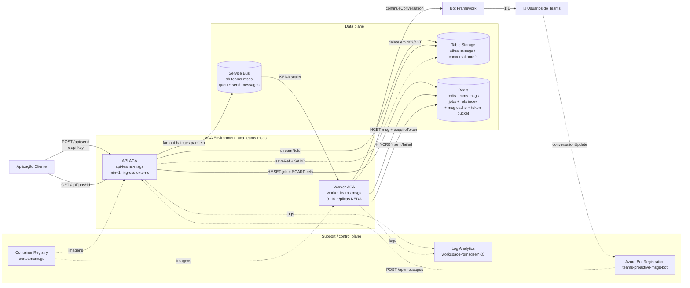
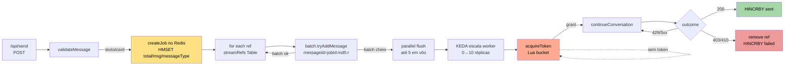
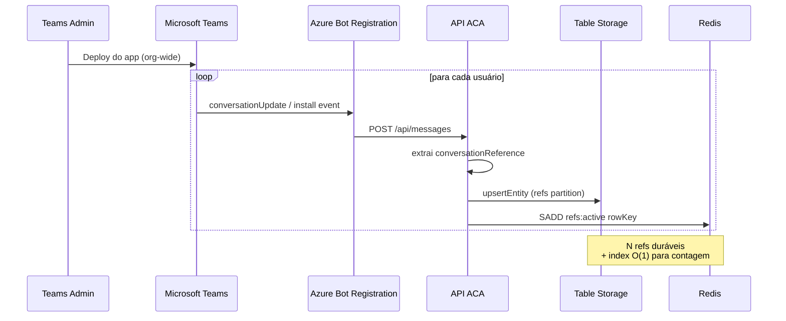
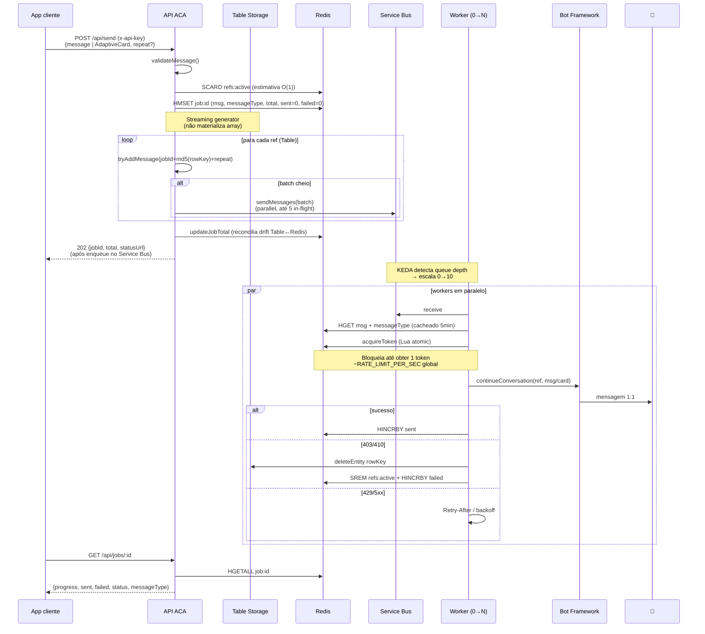
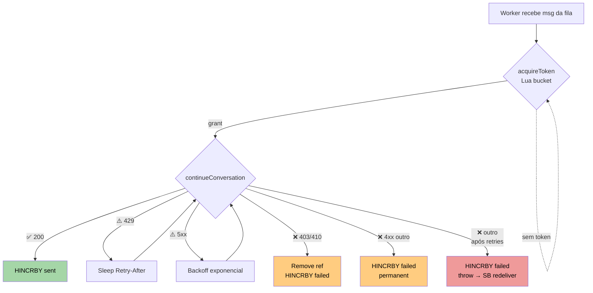
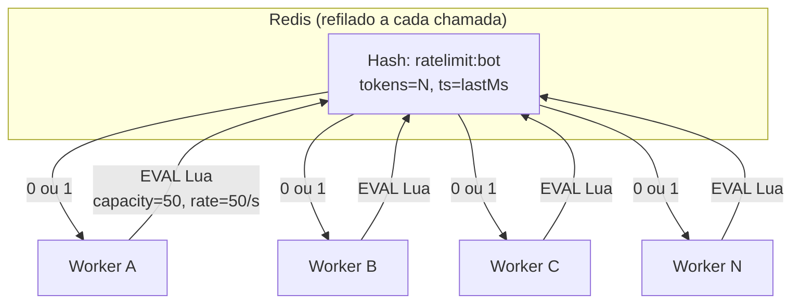

# 📨 Teams Proactive Messaging

Demo de referência para **envio de mensagens proativas 1:1 em massa via Microsoft Teams** — desenhada para escalar para dezenas / centenas de milhares de funcionários, sem cair em rate limits do Power Platform ou Graph API.

> ⚠️ Este repositório é **demo / prova de conceito**. Antes de usar em produção, revise: segurança, escalabilidade, observabilidade, custos e conformidade. Veja [DISCLAIMER.md](./DISCLAIMER.md) e [SUPPORT.md](./SUPPORT.md).

---

## ✨ Highlights da versão atual (v8)

| Capacidade | Como |
|---|---|
| 🚀 Fan-out massivo | Streaming generator das refs + parallel batch flush no Service Bus (5 batches em vôo) |
| 🎯 Token bucket global | Lua script atômico no Redis. `RATE_LIMIT_PER_SEC` aplicado **globalmente** entre todas as réplicas do worker |
| 🎴 Adaptive Cards | `POST /api/send` aceita texto **ou** `{ type:"AdaptiveCard", content:<card> }` |
| 🔁 Idempotência | `messageId = jobId:md5(rowKey):repeatIndex` (efetivo em SB Standard/Premium) |
| 🩺 Health probes | `/healthz` (liveness) + `/readyz` (Redis + Storage + Service Bus configurado) |
| 🔒 Hardened auth | `x-api-key` com `timingSafeEqual` |
| 📊 Job tracking | Counters atômicos em Redis (HINCRBY), TTL 24h, sem race condition |
| 🧪 Testes | Suíte Jest (22 testes) cobrindo retry / rate limit / validação |

---

## Por que essa arquitetura?

Em cenários reais de comunicação corporativa em massa via Teams (10k–100k+ usuários), as alternativas comumente tentadas têm limitações:

| Abordagem | Limitação |
|---|---|
| **Power Automate / Power Platform** | Throttling agressivo (~6k chamadas/dia por conexão), custo por execução, latência alta em massa. |
| **Microsoft Graph (chats / messages)** | Limites por app e por usuário, criação de chat 1:1 é cara, geralmente pensada para uso interativo. |
| **Bot Framework — proactive messaging** | Canal **projetado** para esse caso. ~50 msg/s sustentado por bot, com fan-out por workers. |

Esta demo **não burla rate limits** — usa o canal certo. O envio depende do Teams App estar instalado para cada usuário (org-wide via Admin Center), o que faz o bot capturar uma `conversationReference` por usuário e usá-la depois para mandar mensagens 1:1 sem nova interação.

---

## Índice

- [Arquitetura](#arquitetura)
- [Componentes Azure](#componentes-azure)
- [Fluxo de funcionamento](#fluxo-de-funcionamento)
- [Endpoints da API](#endpoints-da-api)
- [Token Bucket — rate limit global](#token-bucket--rate-limit-global)
- [Segurança](#segurança)
- [Estrutura do projeto](#estrutura-do-projeto)
- [Testes](#testes)
- [Como iniciar (dev local)](#como-iniciar-dev-local)
- [Deploy em Azure](#deploy-em-azure)
- [Deploy do Teams App](#deploy-do-teams-app)
- [Benchmarks](#benchmarks)
- [Decisões de arquitetura (ADR resumido)](#decisões-de-arquitetura-adr-resumido)
- [Roadmap](#roadmap)
- [Troubleshooting](#troubleshooting)

---

## Arquitetura

### Visão geral



**Princípios:**

- **Redis = caminho quente**: counters atômicos (HINCRBY), index de refs ativos (SCARD), cache do payload da mensagem, **token bucket global** (Lua atomic).
- **Table Storage = durabilidade**: fonte da verdade das `conversationReferences`.
- **Service Bus = fan-out**: desacopla API de workers, permite KEDA scale-to-zero, dead-letter para falhas permanentes.
- **ACA = compute**: API com `minReplicas=1` (sempre ouvindo eventos do Teams) + Worker com `minReplicas=0` (custo zero quando ocioso).

### Detalhe — caminho de dados de uma mensagem



---

## Componentes Azure

| Recurso | Nome na demo | SKU | Função |
|---|---|---|---|
| App Registration | associado ao Azure Bot | Free | Identidade do bot (SingleTenant) |
| Azure Bot | `teams-proactive-msgs-bot` | F0 | Registro Bot Framework + canal Teams |
| Container Apps Environment | `aca-teams-msgs` | Consumption | Ambiente compartilhado da API e Worker |
| Container Apps (API) | `api-teams-msgs` | Consumption | Ingress externo, `minReplicas=1` |
| Container Apps (Worker) | `worker-teams-msgs` | Consumption | KEDA scale-to-zero, 0–10 réplicas |
| Service Bus | `sb-teams-msgs` / `send-messages` | Basic | Fila + dead-letter |
| Table Storage | `stteamsmsgs` / `conversationrefs` | Standard LRS | Refs duráveis |
| Azure Cache for Redis | `redis-teams-msgs` | C0 Basic | Counters + refs index + msg cache + token bucket |
| Container Registry | `acrteamsmsgs` | Basic | Imagens API + Worker |
| Log Analytics | `workspace-rgmsgseYKC` | Pay-per-GB | Logs ACA |

> O diagrama separa **data plane** (Table/Redis/Service Bus) de **support/control plane** (Azure Bot, ACR e Log Analytics). ACR e Log Analytics não participam do envio de cada mensagem, mas são recursos reais necessários para build/deploy e operação da demo.

---

## Fluxo de funcionamento

### Fase 1 — Registro de usuários (passivo)



### Fase 2 — Disparo do comunicado (com token bucket)



### Fase 3 — Tratamento de erros



---

## Endpoints da API

| Método | Path | Auth | Descrição |
|---|---|---|---|
| POST | `/api/messages` | Bot Framework token | Endpoint do Bot Framework (configure como Messaging Endpoint no Azure Bot) |
| POST | `/api/send` | `x-api-key` | Enfileira N mensagens no Service Bus e retorna `202 Accepted` após concluir o fan-out |
| GET | `/api/jobs/:id` | `x-api-key` | Progresso do job (Redis) |
| GET | `/api/status` | `x-api-key` | Contagem de usuários registrados |
| GET | `/healthz` | — | Liveness simples |
| GET | `/readyz` | — | Readiness básica (Redis + Storage + Service Bus configurado) |

### `POST /api/send`

Aceita **texto** ou **Adaptive Card**.

**Texto:**
```http
POST /api/send
Content-Type: application/json
x-api-key: <API_KEY>

{
  "message": "📢 Comunicado importante para todos os colaboradores!",
  "repeat": 1
}
```

**Adaptive Card:**
```http
POST /api/send
Content-Type: application/json
x-api-key: <API_KEY>

{
  "message": {
    "type": "AdaptiveCard",
    "content": {
      "type": "AdaptiveCard",
      "version": "1.5",
      "body": [
        { "type": "TextBlock", "size": "Medium", "weight": "Bolder", "text": "Atualização" },
        { "type": "TextBlock", "text": "Conteúdo da mensagem.", "wrap": true }
      ],
      "actions": [
        { "type": "Action.OpenUrl", "title": "Saiba mais", "url": "https://exemplo.com" }
      ]
    }
  }
}
```

| Campo | Tipo | Obrigatório | Descrição |
|---|---|---|---|
| `message` | string \| object | sim | Texto OU `{ type:"AdaptiveCard", content:<card json> }` |
| `repeat` | int | não | Cópias por usuário (default `1`, máx `100000`). Útil para testes de stress |

```json
HTTP/1.1 202 Accepted
{
  "jobId": "d836...",
  "refs": 50000,
  "repeat": 1,
  "total": 50000,
  "enqueued": 50000,
  "drops": 0,
  "messageType": "text",
  "status": "queued",
  "statusUrl": "/api/jobs/d836..."
}
```

> ⚠️ **`repeat` multiplica `refs × repeat`** mensagens reais para o Bot Framework. Use com cuidado em produção — útil principalmente para load testing.
>
> Na implementação atual, o `202 Accepted` é retornado **depois** que a API termina o streaming das refs e enfileira as mensagens no Service Bus. Portanto, um envio para 100k+ usuários ainda pode manter a conexão HTTP aberta durante a fase de enqueue. Uma evolução recomendada é mover o fan-out para um producer/background job e responder imediatamente após `createJob`.

### `GET /api/jobs/:id`

```json
{
  "jobId": "d836...",
  "message": "📢 Comunicado importante para todos os colaboradores!",
  "messageType": "text",
  "total": 50000,
  "sent": 49988,
  "failed": 12,
  "status": "completed",
  "progress": 100,
  "createdAt": "...",
  "updatedAt": "...",
  "errors": ["Usuário bloqueou/desinstalou o bot", "..."]
}
```

| `status` | Significado |
|---|---|
| `queued` | Job criado, mensagens sendo enfileiradas |
| `processing` | Workers estão enviando |
| `completed` | Todas processadas (enviadas + falhadas = total) |

---

## Token Bucket — rate limit global

O worker chama `acquireToken()` antes de cada `continueConversation`. Implementação por **Lua script atômico no Redis** — todas as réplicas competem pela mesma chave, então o limite é **global**, não por worker.



**Algoritmo (Lua atomic):**

1. `tokens, ts ← HMGET ratelimit:bot tokens ts`
2. `elapsed = (now − ts) / 1000`
3. `tokens = min(capacity, tokens + elapsed × rate)`
4. Se `tokens ≥ 1` → consome 1 e retorna `1`. Senão retorna `0`.
5. `HSET tokens ts; EXPIRE 60`

**Configuração:**

| Env var | Default | Descrição |
|---|---:|---|
| `RATE_LIMIT_ENABLED` | `true` | Liga/desliga o bucket no worker |
| `RATE_LIMIT_PER_SEC` | `50` | Taxa de refill (tokens/s) — **teto global de envios** |
| `RATE_LIMIT_CAPACITY` | `50` | Burst máximo (tokens acumuláveis) |
| `RATE_LIMIT_KEY` | `ratelimit:bot` | Namespace da chave (útil se compartilhar Redis) |

**Quando ajustar:**

- `RATE_LIMIT_PER_SEC=50`: default seguro pra Bot Framework F0.
- Se a Microsoft te garantir SLA superior, suba (ex.: `100` ou `200`).
- Para teste de fumaça **sem** rate limit: `RATE_LIMIT_ENABLED=false`.

---

## Segurança

- `POST /api/send`, `GET /api/jobs/:id`, `GET /api/status` exigem header `x-api-key` quando `API_KEY` está definida.
- Comparação com `crypto.timingSafeEqual` (não vulnerável a timing attacks).
- Em **dev local**, deixar `API_KEY` vazia desliga a checagem (a API loga um warning ao iniciar).
- Em **produção / cliente**, considere alternativas mais robustas (em ordem de robustez):
  - Entra ID com client credentials + JWT bearer + middleware de validação;
  - APIM como front-door com policies;
  - ACA com ingress interno + APIM/AGW público;
  - mTLS ou IP allowlist via NSG.
- Secrets sensíveis (`MICROSOFT_APP_PASSWORD`, `SERVICE_BUS_CONNECTION`, `STORAGE_CONNECTION`, `REDIS_CONNECTION`, `API_KEY`) devem ir em **ACA secrets** ou **Key Vault** com Managed Identity, nunca em env vars planas.

---

## Estrutura do projeto

```
teams_msgs/
├── src/                          # API (ACA, ingress externo)
│   ├── index.ts                  # Express + endpoints + auth + healthz/readyz
│   ├── bot.ts                    # ProactiveBot (captura conversationReferences)
│   ├── table-store.ts            # Refs duráveis em Table Storage + streamRefs()
│   ├── redis-tracker.ts          # Job counters + refs index + msg cache + token bucket
│   ├── send-retry.ts             # Helper puro de retry (testável)
│   └── validate-message.ts       # Validador puro (text vs AdaptiveCard)
├── worker/                       # Worker (ACA, KEDA scale-to-zero)
│   ├── src/
│   │   ├── index.ts              # bootstrap
│   │   ├── worker.ts             # SB consumer + Bot Framework sender + token bucket
│   │   ├── redis-tracker.ts      # incrementSent/Failed + getJobMessage + acquireToken
│   │   └── table-store.ts        # removeRefByRowKey (limpeza em 403/410)
│   └── Dockerfile
├── __tests__/                    # Suite Jest (npm test)
│   ├── rate-limit.test.ts        # Token bucket math (6 tests)
│   ├── send-retry.test.ts        # Retry / 429 / 403 / 5xx (9 tests)
│   └── validate-message.test.ts  # Validação text/AdaptiveCard (7 tests)
├── manifest/                     # Pacote Teams App
│   ├── manifest.json             # Substitua <MICROSOFT_APP_ID> e <your-api-fqdn>
│   ├── color.png                 # 192×192
│   └── outline.png               # 32×32
├── load_test/
│   ├── run-50k.js                # Single-job, N usuários simulados
│   └── run-waves.js              # Waves sequenciais (cold start vs warm)
├── Dockerfile                    # API (com HEALTHCHECK)
├── jest.config.js
├── tsconfig.json
├── package.json                  # engines.node>=20, scripts.test=jest
├── .env.example
├── DISCLAIMER.md
├── SUPPORT.md
├── LICENSE
└── README.md
```

---

## Testes

```bash
npm install
npm test
```

```
PASS __tests__/validate-message.test.ts
PASS __tests__/send-retry.test.ts
PASS __tests__/rate-limit.test.ts

Test Suites: 3 passed, 3 total
Tests:       22 passed, 22 total
```

| Suíte | Cobertura |
|---|---|
| `rate-limit.test.ts` | Token bucket math (refill, cap, sustained rate ~50/s), Lua script sanity |
| `send-retry.test.ts` | 200/429/403/410/5xx/4xx/transient, Retry-After header parsing |
| `validate-message.test.ts` | Texto vazio, número, null, AdaptiveCard malformado, AdaptiveCard válido |

Os helpers `sendWithRetry` e `validateMessage` foram **extraídos** para módulos puros (sem dependência do `BotFrameworkAdapter`), permitindo unit tests sem mocks pesados.

---

## Como iniciar (dev local)

```bash
git clone https://github.com/EdneiMonteiro/teams_msgs.git
cd teams_msgs
npm install
cd worker && npm install && cd ..
cp .env.example .env       # edite com seus valores

# Rodar testes
npm test

# Rodar API local
npm run dev                # http://localhost:3978

# Em outro terminal — expor para o Bot Framework:
ngrok http 3978
# → atualize o Messaging Endpoint do Azure Bot para https://<ngrok>/api/messages
```

Para rodar o worker localmente (apontando para Redis/Service Bus reais):
```bash
cd worker
npm run build && npm start
```

---

## Deploy em Azure

```bash
RG=rg-teams-msgs
LOC=eastus2
ACR=acrteamsmsgs
API_TAG=v8
WORKER_TAG=v6

# Resource group + recursos base
az group create -n $RG -l $LOC
az servicebus namespace create -g $RG -n sb-teams-msgs --sku Basic
az servicebus queue create -g $RG --namespace-name sb-teams-msgs \
  -n send-messages --max-delivery-count 5
az storage account create -g $RG -n stteamsmsgs --sku Standard_LRS
az redis create -g $RG -n redis-teams-msgs -l $LOC --sku Basic --vm-size c0
az acr create -g $RG -n $ACR --sku Basic --admin-enabled true

# ACA Environment compartilhado
az containerapp env create -g $RG -n aca-teams-msgs -l $LOC

# Build das imagens
az acr build -r $ACR -t teams-msgs-api:$API_TAG -f Dockerfile .
az acr build -r $ACR -t teams-msgs-worker:$WORKER_TAG -f worker/Dockerfile worker/

# Deploy API (ingress externo, always-on)
az containerapp create -g $RG -n api-teams-msgs \
  --environment aca-teams-msgs \
  --image $ACR.azurecr.io/teams-msgs-api:$API_TAG \
  --min-replicas 1 --max-replicas 3 \
  --ingress external --target-port 3978 \
  --secrets sb-conn=<sb> st-conn=<st> redis-conn=<redis> \
            app-pwd=<bot> api-key=<random> \
  --env-vars MICROSOFT_APP_ID=<id> MICROSOFT_APP_TENANT_ID=<tenant> \
             PORT=3978 \
             SEND_FLUSH_CONCURRENCY=5 \
             SERVICE_BUS_CONNECTION=secretref:sb-conn \
             STORAGE_CONNECTION=secretref:st-conn \
             REDIS_CONNECTION=secretref:redis-conn \
             MICROSOFT_APP_PASSWORD=secretref:app-pwd \
             API_KEY=secretref:api-key

# Atualizar Messaging Endpoint do Azure Bot
az bot update -g $RG -n teams-proactive-msgs-bot \
  --endpoint "https://<api-fqdn>/api/messages"

# Deploy Worker (KEDA scale-to-zero + token bucket)
az containerapp create -g $RG -n worker-teams-msgs \
  --environment aca-teams-msgs \
  --image $ACR.azurecr.io/teams-msgs-worker:$WORKER_TAG \
  --min-replicas 0 --max-replicas 10 \
  --secrets sb-conn=<sb> st-conn=<st> redis-conn=<redis> app-pwd=<bot> \
  --env-vars MICROSOFT_APP_ID=<id> MICROSOFT_APP_TENANT_ID=<tenant> \
             MAX_CONCURRENT=10 \
             RATE_LIMIT_ENABLED=true \
             RATE_LIMIT_PER_SEC=50 \
             RATE_LIMIT_CAPACITY=50 \
             SERVICE_BUS_CONNECTION=secretref:sb-conn \
             STORAGE_CONNECTION=secretref:st-conn \
             REDIS_CONNECTION=secretref:redis-conn \
             MICROSOFT_APP_PASSWORD=secretref:app-pwd \
  --scale-rule-name sb-queue-rule \
  --scale-rule-type azure-servicebus \
  --scale-rule-metadata queueName=send-messages messageCount=5 \
  --scale-rule-auth connection=sb-conn
```

> O ambiente de demonstração validado usa `teams-msgs-api:v8` e `teams-msgs-worker:v6`. Para novos clientes, mantenha tags explícitas por release e evite depender apenas de `latest`.

---

## Deploy do Teams App

1. Edite `manifest/manifest.json` substituindo `<MICROSOFT_APP_ID>` e `<your-api-fqdn>`.
2. Empacote: `cd manifest && zip ../teams-app.zip manifest.json color.png outline.png`
3. Suba em **Teams Admin Center → Manage apps → Upload new app**.
4. **Setup policies → Global → Installed apps → Add apps** (org-wide).
5. Propagação org-wide leva 24–48h. Para testes imediatos, instale manualmente em **Apps → Built for your org**.

---

## Benchmarks

Medidos em ambiente real: 1–10 worker ACA (0.5 vCPU, 1Gi), Redis C0 Basic, Table Storage LRS, Service Bus Basic. Cada job dispara N mensagens 1:1 a partir de 1 POST.

### Resultado de referência — single-job 50K (versão atual, v8 com rate limit)

| Métrica | Valor |
|---|---|
| Total de mensagens | **50.002** |
| Enviadas | **50.002** (100%) |
| Falhas | **0** |
| Tempo de enqueue (Service Bus) | **41.6s** |
| Tempo de processamento | **734.3s** (~12 min 14 s) |
| Tempo total | **775.9s** (~13 min) |
| **Throughput observado pelo script de load** | **4.086 msg/min** (~68 msg/s, janela de processamento medida pelo cliente) |
| Rate limit configurado | `RATE_LIMIT_PER_SEC=50` (teto teórico ~3.000 msg/min) |

> ⚠️ A v8 introduz **token bucket global no Redis**. O throughput agora é **deliberadamente limitado** pelo `RATE_LIMIT_PER_SEC`, que deve ser ajustado ao limite efetivo do Bot Framework no tenant do cliente. O número acima é a métrica observada pelo script de load na janela de processamento do job; não substitui telemetria operacional do bucket/token ou do Bot Framework. Em demos sem rate limit (v6/v7), o throughput chegava a 30–40k msg/min — mas em produção o Bot Framework rejeitaria essa carga com 429 em cascata.

### Histórico de evolução (mesmo cenário — 50K refs)

| Versão | Mudança principal | Throughput | Falhas | Observação |
|---|---|---:|---:|---|
| v1 (POC) | Cosmos DB + ETag retries | — | travado em 71% | Race condition em writes concorrentes |
| v3 | Redis (counters) + Table Storage (refs/jobs) | 30.976 msg/min | 0 | Job tracking no Redis resolve race condition |
| v6 | Redis (counters + refs index + msg cache) + Table Storage (refs only) | 42.821 msg/min | 0 | Mensagem cacheada no Redis, payload SB menor |
| v7 | Param `repeat` no `/api/send` | 37.089 msg/min | 0 | Variância natural ~13% (Bot Framework + SB Basic compartilhados) |
| **v8 (atual)** | **Streaming + Adaptive Cards + Token Bucket Redis + Jest** | **4.086 msg/min** | **0** | Observado pelo script de load; protegido por token bucket |

**Visualização do throughput sustentado por versão:**

```
v1   ░░░░░░░░░░░░░░░░░░░░░░░░░░░░░░░░░░░░░░░░  TRAVADO @ 71%
v3   ████████████████████░░░░░░░░░░░░░░░░░░░░  30.976 msg/min
v6   ████████████████████████████░░░░░░░░░░░░  42.821 msg/min  ← teto sem rate limit
v7   █████████████████████████░░░░░░░░░░░░░░░  37.089 msg/min
v8   ███░░░░░░░░░░░░░░░░░░░░░░░░░░░░░░░░░░░░░   4.086 msg/min  ← observado com RATE_LIMIT_PER_SEC=50
```

### Sem rate limit (workload "nu", v6/v7)

| Refs | Total Msgs | Sent | Failed | Enqueue | Processing | Throughput |
|---:|---:|---:|---:|---:|---:|---:|
| 500 | 502 | 502 | 0 | 0.9s | 50.7s | 595 msg/min ¹ |
| 1.000 | 1.002 | 1.002 | 0 | 0.7s | 3.2s | 18.953 msg/min |
| 10.000 | 10.002 | 10.002 | 0 | 16.5s | 12.9s | 46.481 msg/min |
| 15.000 | 15.002 | 15.002 | 0 | 13.2s | 57.5s | 15.654 msg/min ¹ |

¹ Throughput menor por cold start do KEDA (scale-to-zero → primeiro container demora ~45s para subir).

> 📌 Os números usam **fake refs** (clones de uma ref real), que validam o caminho de fan-out, fila, autoscale, job tracking e remoção de refs inválidas. Em produção:
> - **Bot Framework é o gargalo final** (~50 msg/s sustentado por bot, ~3.000 msg/min)
> - 100k mensagens em ~30–40 minutos com 1 bot
> - Para janelas mais agressivas, paralelizar com múltiplos bots por audiência
> - **Recomendação**: manter `RATE_LIMIT_PER_SEC=50` (default) e ajustar conforme sua negociação com Microsoft

---

## Decisões de arquitetura (ADR resumido)

| Decisão | Por quê |
|---|---|
| **SingleTenant bot** | MultiTenant foi descontinuado no Azure Bot (mai/2026). UserAssignedMSI é mais complexo sem benefício para o caso de uso. |
| **ACA em vez de Functions** | Functions com B1 plan dá timeout de startup com node_modules grande. ACA + KEDA tem melhor ergonomia para workloads queue-driven longos. |
| **Redis para counters** | Cosmos DB com ETag travava em ~71% num cenário de 50K writes concorrentes ao mesmo doc. `HINCRBY` no Redis é atomic e O(1). |
| **Table Storage para refs** | Cheap (~$0.01/mês), durável, write-rare-read-bulk, sem hot partition para 100k+. |
| **Service Bus Basic** | Suficiente para queue + dead-letter. Standard só vale se precisar duplicate detection nativo. |
| **Token bucket no Redis (Lua)** | Único ponto de coordenação atomic entre N réplicas; fica naturalmente onde counters e msg cache já estão. |
| **Streaming refs** | Para 100k+ refs, materializar array em memória dá OOM. Generator yield + parallel flush = O(1) memory. |
| **Adaptive Cards via union type** | Mantém retrocompatibilidade. Cards grandes ainda cabem no SB (256KB Basic). |

---

## Roadmap

Implementado em **v8** (esta versão):
- ✅ Token bucket global no Redis (RATE_LIMIT_PER_SEC / RATE_LIMIT_CAPACITY)
- ✅ Adaptive Cards no `/api/send`
- ✅ Streaming refs + parallel batch flushing
- ✅ Suite de testes Jest (`npm test`)
- ✅ `timingSafeEqual` no comparador de API_KEY
- ✅ Drop tracking (mensagens > 256KB → `incrementFailed`)

Não implementado (próximas evoluções):

- **Backpressure adaptativo** — reduzir concorrência por worker quando 429s aparecerem; aumentar quando 200s sustentados.
- **Segmentação de audiência** — `POST /api/send` com filtro (lista CSV, departamento, país, tags).
- **Idempotência forte** — Service Bus Standard/Premium com duplicate detection (`messageId` já populado).
- **Reconciliação periódica Redis ↔ Table** — job timer para sincronizar `refs:active` SET com a tabela.
- **Producer assíncrono para fan-out** — responder `202` imediatamente e enfileirar refs fora da requisição HTTP.
- **Validação avançada de Adaptive Cards** — validar schema/tamanho antes de criar jobs massivos.
- **Particionamento das refs** — distribuir entre múltiplas partitions por hash, evitando hot partition.
- **Auditoria + governança** — modelo de "campanha" com owner, aprovação, dry-run, histórico.
- **OIDC / Entra ID** — substituir `x-api-key` por validação de JWT.
- **Logs estruturados + métricas** — pino/winston JSON, OpenTelemetry, métricas Prometheus customizadas.
- **Métricas do token bucket** — observar tokens concedidos/negados e taxa efetiva por janela.
- **Cancelamento de job** (`POST /api/jobs/:id/cancel`) — útil para abortar broadcast em curso.
- **Webhook de conclusão** — POST callback ao cliente quando job termina.

---

## Troubleshooting

| Sintoma | Causa | Solução |
|---|---|---|
| `Authorization denied` no envio | Service Principal ausente no tenant alvo | `az ad sp create --id <app-id>` |
| `Failed to decrypt conversation id` | Tipo do bot foi alterado depois das refs serem salvas | Limpe a tabela `conversationrefs` e reinstale o Teams app |
| `401 Unauthorized` em `/api/send` | `x-api-key` faltando ou divergente | Veja env var `API_KEY` na ACA |
| Workers não escalam | Regra KEDA mal configurada | `az containerapp show` e verifique `scale.rules` |
| Throughput muito baixo (~3-4k msg/min) | `RATE_LIMIT_PER_SEC` ativo (comportamento esperado em v8) | Para testes "nus", use `RATE_LIMIT_ENABLED=false`; para produção, ajuste conforme limite aprovado |
| `403 Forbidden` em alguns usuários | Usuário bloqueou ou desinstalou o bot | Normal — worker remove a ref automaticamente |
| `429 Too Many Requests` em volume | Throttling do Bot Framework apesar do rate limit | Reduza `RATE_LIMIT_PER_SEC` (ex.: 30) |
| `400 AdaptiveCard precisa de 'content'` | `message.content` ausente ou não-objeto | Veja [Endpoints da API](#endpoints-da-api) — content tem que ter `type:"AdaptiveCard"` |
| `Length of 'messageId' property cannot be greater than 128` | Custom messageId muito longo | Já corrigido em v6 (md5 do rowKey); rebaixe imagem se persistir |
| `/readyz` retorna 503 | Redis ou Storage não acessíveis, ou Service Bus não configurado | Cheque connection strings, secrets da ACA e regras de firewall |
| Job travado em < 100% indefinidamente | Mensagens na DLQ, payload expirado no Redis ou drift de refs | `az servicebus queue show … countDetails`, cheque `deadLetterMessageCount` e reconcilie `refs:active` com a Table |
| `npm test` falha com erro de tipo | Versão do TS/Node incorreta | `engines.node>=20` no package.json — use Node 20+ |

---

## Suporte e Aviso Legal

- Sem SLA nem suporte oficial. Veja [SUPPORT.md](./SUPPORT.md).
- Uso sujeito a [DISCLAIMER.md](./DISCLAIMER.md).
- **Não afiliado nem endossado pela Microsoft.** Marcas usadas apenas para descrição.
